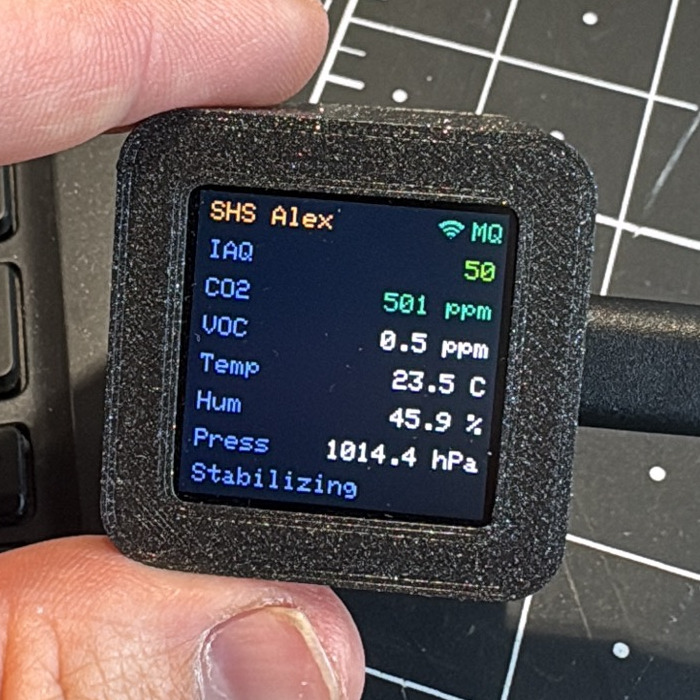

# Smart Home Sensor Starter Kit

A hands-on introduction to building a Wi-Fi-connected indoor air-quality sensor that lives on
your shelf and feeds [Home Assistant](https://www.home-assistant.io/). You'll learn the basics
of microcontroller programming, I2C sensors, air-quality processing, and how a DIY device shows
up as a first-class entity in a smart-home platform — while building something genuinely useful.

The device reads a Bosch **BME680** environmental sensor, runs Bosch's **BSEC2** algorithm to
derive an air-quality index, shows the live values on a colour display, and publishes them to
Home Assistant.



---

## What You'll Build

By the end of the workshop you'll have a mains/USB-powered sensor that:
- Measures **temperature, humidity, and barometric pressure**
- Derives an **Indoor Air Quality (IAQ)** index, a **CO₂-equivalent**, and a **breath-VOC**
  estimate from the BME680's gas sensor via Bosch BSEC2
- Shows all readings live on a **240×240 colour display**, colour-coded by air quality
- Reports every reading to **Home Assistant**, where you can chart it, automate on it, and
  trigger a "open a window" notification when the air gets stuffy

No soldering of a circuit board required — the sensor connects to the board with four jumper
wires.

---

## What's in the Kit

- Waveshare **ESP32-C6-LCD-1.3** microcontroller (ESP32-C6 + 1.3" ST7789 display)
- **BME680** sensor module (temperature, humidity, pressure, gas / air quality)
- 4× jumper wires (or a 4-pin Dupont cable)
- USB-C cable
- _Optional:_ 3D-printed enclosure

---

## Before You Begin

Make sure you have:
- A computer with a USB-C port (or adapter)
- A 2.4 GHz Wi-Fi network
- A running **Home Assistant** instance (a Raspberry Pi, mini-PC, or VM is fine)
- For the main build: the [Arduino IDE](https://www.arduino.cc/en/software) and the
  **Mosquitto broker** add-on in Home Assistant

Everything else — board support, libraries, and configuration — is covered step by step in the
build instructions.

---

## Build Instructions

**Start here:** [`instructions/build_instructions.md`](instructions/build_instructions.md)

That guide covers wiring, flashing, and connecting the device to Home Assistant for both
firmware variants below.

---

## Learning Goals

- Wire and read an I2C sensor
- Understand what **IAQ**, **CO₂-equivalent**, and **VOC** actually mean, and why a gas sensor
  needs a multi-day self-calibration window
- Drive a colour SPI display and design a readable at-a-glance UI
- Connect a DIY device to Home Assistant via **MQTT auto-discovery** and understand how
  ESPHome's native API offers an alternative approach

---

## Firmware Variants

Two firmwares are provided. Both expose the same readings to Home Assistant.

| Variant | Path | Integration | Who it's for |
|---------|------|-------------|--------------|
| **Main build** | [`code/shs_modular/`](code/shs_modular/) | Arduino + **MQTT** auto-discovery | Student workshops — keeps the custom display UI and teaches the full firmware path |
| **Alternative** _(untested)_ | [`code/esphome/`](code/esphome/) | **ESPHome** native API | Quickest path / no custom code; minimal display only — not verified on hardware |

The main build is a modular Arduino sketch; every feature is toggled by a flag in
[`code/shs_modular/config.h`](code/shs_modular/config.h):

```c
#define USE_DISPLAY  1   // ST7789 colour display
#define USE_MQTT     1   // Wi-Fi + MQTT publishing to Home Assistant
```

Set `USE_MQTT` to `0` for a standalone display-only device (no network).

---

## Repository Structure

```
code/
  shs_modular/             Main firmware (Arduino + BSEC2 + display + MQTT)
    config.example.h       Template — copy to config.h and fill in your credentials
    config.h               Your local credentials (gitignored)
    shs_modular.ino        Entry point
    display.ino            ST7789 UI
    bme680.ino             BME680 read path via Bosch BSEC2
    wifi.ino               WiFiManager connection
    mqtt.ino               MQTT publishing + Home Assistant auto-discovery
    utils.ino              Shared helpers
    bsec_config_33v_3s_4d.h  BSEC tuning blob (3.3 V, 3 s sample rate)
  esphome/
    smart_home_sensor.yaml Alternative ESPHome firmware
  legacy/
    test_wv_display/       Original display+sensor sketch (no networking, reference)

hardware/
  3d-print/                Enclosure parts (Main/thin body, lid, FreeCAD source)

instructions/
  build_instructions.md    Main build guide — start here
  background_information.md Sensor theory, IAQ explained, MQTT vs ESPHome, system overview
  quick_reference/         One-page summary

img/                       Photos and diagrams (TODO)
```

---

## Background Reading

[`instructions/background_information.md`](instructions/background_information.md) covers:

- **Sensor selection** — why the BME680 + BSEC over simpler temperature/humidity sensors, and
  what IAQ / CO₂-equivalent / VOC numbers actually represent
- **Self-heating** — why the reported temperature needs an offset, and how to calibrate it
- **How the system works** — the full path from the BME680 through the firmware to a Home
  Assistant entity, comparing MQTT auto-discovery against the ESPHome native API
- **Similar projects** — related open-source air-quality builds for further inspiration

---

## Licenses

| Component | License |
|-----------|---------|
| Software (`code/`) | [MIT](LICENSE.code) |
| Hardware (`hardware/`) | [CERN-OHL-W 2.0](LICENSE.hardware) |
| Documentation (`instructions/`, `README.md`, `img/`) | [CC-BY 4.0](LICENSE.docs) |
