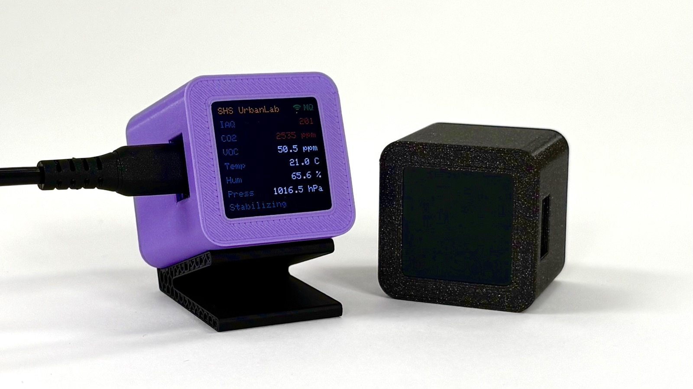

# Smart Home Sensor



An open hardware and firmware kit for a Wi-Fi-connected indoor air-quality sensor, built as a hands-on introduction to microcontroller programming, I2C sensors, air-quality processing, and connecting a DIY device to a smart home system. It is designed to be teachable in a workshop, but the device is meant to stay on a shelf afterwards and keep reporting.

The device reads a Bosch BME680 environmental sensor, runs Bosch's BSEC2 algorithm to derive an air-quality index, shows the live values on a colour display, and publishes them to [Home Assistant](https://www.home-assistant.io/) over MQTT or to the [diy-sensor.org](https://diy-sensor.org) dashboard. The backend is chosen by picking a firmware image at flash time.

Firmware can be built from source with the Arduino IDE, or flashed straight from the browser with the [web flasher](https://alexanderkutschera.com/smart_home_sensor/), which skips the toolchain entirely.

---

## Why This Exists

I wanted a workshop topic that touches sensors, microcontrollers, and IoT all at once, without turning into a semester course. This is the result: a one to two hour teaser that scratches the surface of a lot of things rather than going deep into any single one. None of it is novel, and that is fine. It is meant to be a good starting point.

The build is deliberately not hardwired. The BME680 hangs off four jumper wires, and the board is an ordinary ESP32-C6 with a display. If an air-quality sensor turns out not to be useful to someone, I hope the parts get pulled apart and turned into something else entirely. That would be the better outcome anyway.

---
## What the Device Does

A mains/USB-powered sensor that:
- Measures temperature, humidity, and barometric pressure
- Derives an Indoor Air Quality (IAQ) index, a CO₂-equivalent, and a breath-VOC estimate from the BME680's gas sensor via Bosch BSEC2
- Shows all readings live on the integrated 240×240 colour display, colour-coded by air quality
- Reports every reading to Home Assistant (where it can be charted, automated on, and turned into an "open a window" notification when the air gets stuffy), to plain MQTT topics, or to the diy-sensor.org dashboard, which needs no server of its own

There is no deep sleep and no battery: the live display and BSEC's multi-day gas-sensor self-calibration both need the device to run continuously.

---
## Hardware

- Waveshare ESP32-C6-LCD-1.3 microcontroller (ESP32-C6 + 1.3" ST7789 display)
- BME680 sensor module (temperature, humidity, pressure, gas / air quality)
- 4× Dupont wires (single wires or a 4-pin cable, either works)
- USB-C cable
- _Optional:_ 3D-printed enclosure ([`hardware/3d-print/`](hardware/3d-print/))

There is no custom PCB. The Dupont wires are soldered to the BME680 module's header pads, and their connectors then plug onto the board's pins, so the sensor-to-board link stays removable.

---

## Requirements

For any build:
- A computer with a USB-C port (or adapter)
- A 2.4 GHz Wi-Fi network (the ESP32-C6 will not see a 5 GHz-only network)
- A soldering iron, to solder the Dupont wires to the BME680 module (the only soldering in the build)

For flashing from the browser, that is the whole list: the web flasher needs a browser that supports Web Serial (Chromium, Chrome, Edge, or Opera; not Firefox or Safari).

For the Home Assistant build, additionally:
- A running Home Assistant instance (a Raspberry Pi, mini-PC, or VM is fine)
- The Mosquitto broker add-on and the MQTT integration

To build from source instead of flashing a prebuilt image:
- The [Arduino IDE](https://www.arduino.cc/en/software) with the ESP32 board package and the libraries listed in the build instructions

---

## Documentation

| Guide                                                                              | Covers                                                                                                            |
| ---------------------------------------------------------------------------------- | ----------------------------------------------------------------------------------------------------------------- |
| [`instructions/build_instructions.md`](instructions/build_instructions.md) | The standard build: wiring, browser flashing, setup portal, first readings |
| [`instructions/build_instructions_extended.md`](instructions/build_instructions_extended.md) | Building the firmware from source: Arduino toolchain, BSEC blob, MQTT and Home Assistant |
| [`instructions/background_information.md`](instructions/background_information.md) | BME680 + BSEC, IAQ / CO₂-equivalent / VOC, self-heating and offset calibration, MQTT vs ESPHome, similar projects |
| [`instructions/quick_reference/`](instructions/quick_reference/)                   | Printable one-page summary                                                                                        |
| [`web-flasher/README.md`](web-flasher/README.md)                                   | Building and publishing the firmware images                                                                       |

---

## Firmware Variants

One Arduino sketch in [`code/shs_modular/`](code/shs_modular/) builds every image. They all share the display UI, the BSEC read path, and the setup portal, and differ only in where the readings go.

| Image | Reports to | Needs | Suited for |
| --- | --- | --- | --- |
| **diy-sensor.org** | [diy-sensor.org](https://diy-sensor.org), keyless | Wi-Fi | Running without a smart home system, using a hosted dashboard instead |
| **Home Assistant** | MQTT auto-discovery | Wi-Fi, MQTT broker | Keeping the device permanently in an existing smart home |
| **Display only** | nothing | nothing | Checking the hardware before dealing with a network |

Per-device values (device name, broker address, API key, publish interval, temperature offset) all live in the device's flash and are edited from a setup portal the device serves over its own Wi-Fi access point. Nothing needs recompiling per device.

### Workshop images

The build script can also produce a workshop image: the diy-sensor.org firmware with an event's defaults and API credentials compiled in, so the devices come up already pointed at the right dashboard and there is far less to configure on the day. The presets are only defaults, and the setup portal still overrides them. This is why the sketch builds four images rather than three. See [`web-flasher/README.md`](web-flasher/README.md) for how such an image is built and why its credentials stay out of the publicly served ones.

### ESPHome alternative

[`code/esphome/`](code/esphome/) holds an ESPHome configuration for the same hardware: native Home Assistant API, no broker, minimal display. Not yet verified on hardware.

---

## Repository Structure

```
code/
  shs_modular/             Firmware (Arduino + BSEC2 + display + backends)
    config.h               Pins, build variant, factory defaults — no credentials
    workshop_secrets.example.h  Template for the workshop API key (copy, gitignored)
    shs_modular.ino        Entry point
    settings.ino           Runtime settings in NVS + derived device identity
    portal.ino             Setup portal: Wi-Fi, settings, live readings, send test
    resetdetect.ino        Double-reset detection (re-opens the portal)
    display.ino            ST7789 UI
    bme680.ino             BME680 read path via Bosch BSEC2
    wifi.ino               Station connect + background reconnect
    mqtt.ino               MQTT: HA auto-discovery / flat topics / both
    sensorboard.ino        HTTPS publishing to diy-sensor.org
    utils.ino              Shared helpers
    bsec_config_33v_3s_4d.h  BSEC tuning blob (3.3 V, 3 s sample rate)
  esphome/
    smart_home_sensor.yaml Alternative ESPHome firmware
  legacy/
    test_wv_display/       Original display+sensor sketch (no networking, reference)

web-flasher/               Browser-based installer (ESP Web Tools) + build.sh

hardware/
  3d-print/                Enclosure parts (Main/thin body, lid, FreeCAD source)

instructions/
  build_instructions.md    Standard build guide — start here
  build_instructions_extended.md  Arduino toolchain, building from source, MQTT
  background_information.md Sensor theory, IAQ explained, MQTT vs ESPHome, system overview
  quick_reference/         One-page summary

img/                       Photos and diagrams (TODO)
```

---

## Licenses

| Component | License |
|-----------|---------|
| Software (`code/`) | [MIT](LICENSE.code) |
| Hardware (`hardware/`) | [CERN-OHL-W 2.0](LICENSE.hardware) |
| Documentation (`instructions/`, `README.md`, `img/`) | [CC-BY 4.0](LICENSE.docs) |
