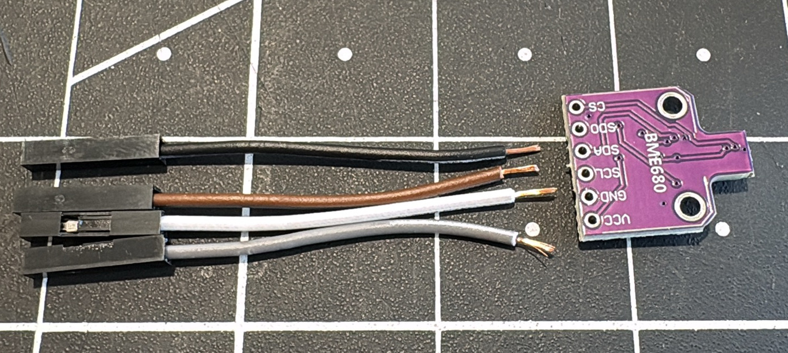
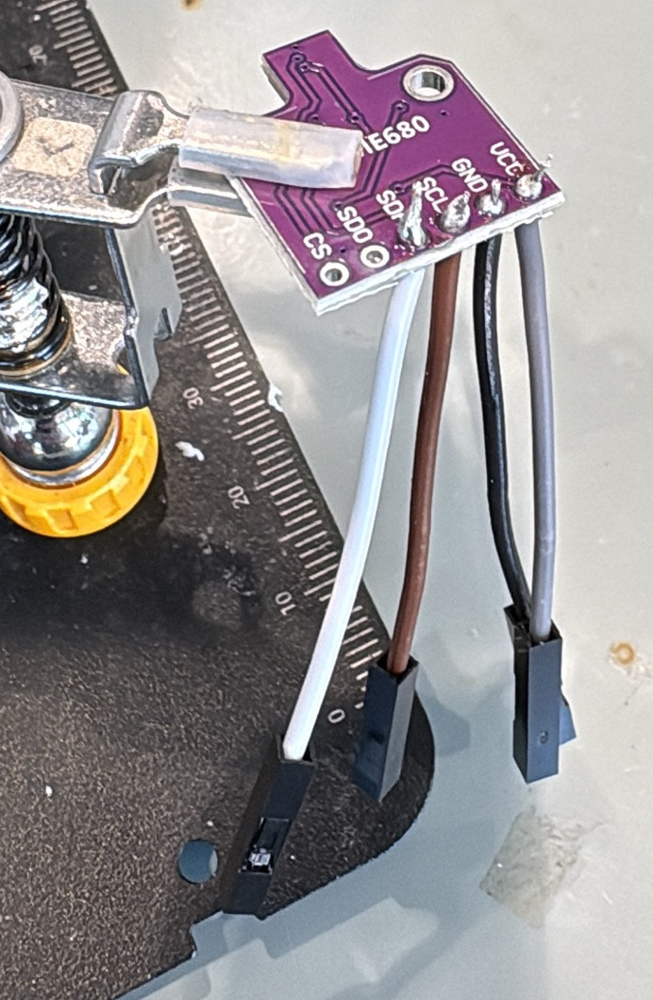
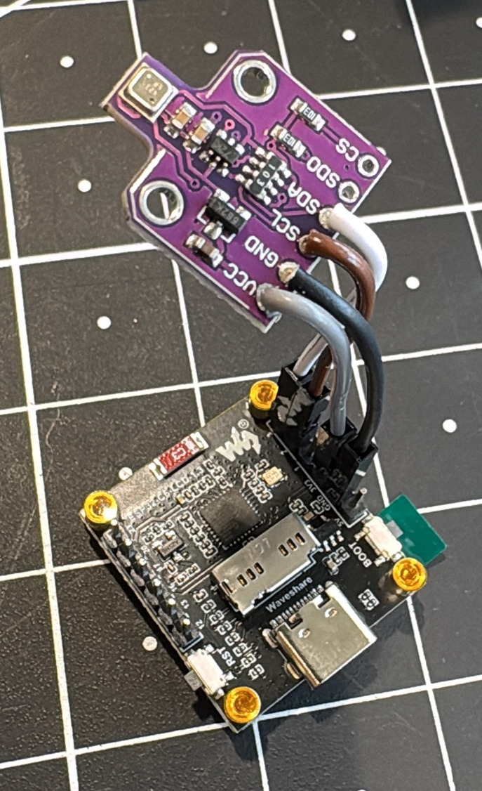
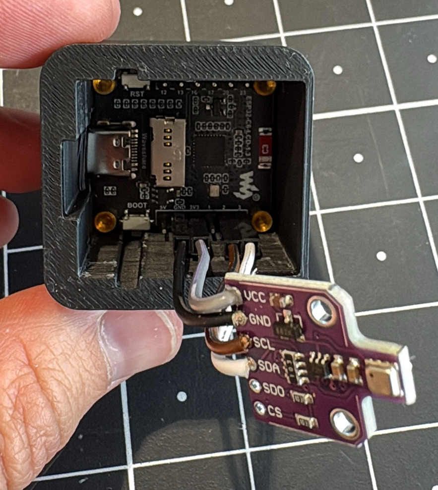
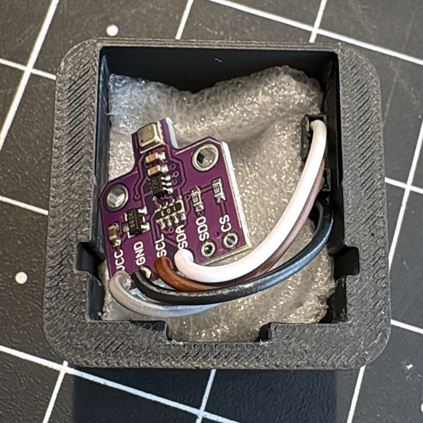

# Build Instructions — Smart Home Sensor

This guide covers the full build: wiring the **BME680** to the **Waveshare ESP32-C6-LCD-1.3**,
flashing the firmware, and connecting the device to **Home Assistant**.

There is **no custom circuit board** — the sensor connects with four jumper wires. The device
is **always on** (USB powered): the live display and the BME680's multi-day air-quality
self-calibration mean it never goes to sleep.

Two firmware variants are covered:

- **Main build — Arduino + MQTT** (§4–6): keeps the colour display UI and teaches the full
  firmware. *Recommended for the workshop.*
- **Alternative — ESPHome** (§7): the quickest path, fewer steps, minimal display.

Do the wiring (§1–3) first; then pick **one** firmware path.

> **In a hurry?** [`short_workshop.md`](short_workshop.md) does the whole thing in 90
> minutes with a browser-based flasher and no toolchain at all, reporting to a shared
> dashboard instead of Home Assistant. Come back here when you want to build from source
> or keep the device on your own smart home.

---

## 1. Collect All Parts

**Electronics**
- Waveshare ESP32-C6-LCD-1.3 microcontroller (ESP32-C6 + 1.3" ST7789 display)
- BME680 sensor module
- 4× female–female jumper wires (or a 4-pin Dupont cable)
- USB-C cable

**Optional**
- 3D-printed enclosure (see [`hardware/3d-print/`](../hardware/3d-print/))
- Styrofoam packing insert from the ESP32 box — keep it, it's used as a heat barrier in §3

**Tools**
- A computer with a USB-C port
- _(Only if your BME680 ships without a soldered header:)_ soldering iron + solder

---

## 2. Wire the BME680 to the Board

The BME680 talks to the board over **I2C** — two data lines plus power and ground.



| BME680 pin | Board pin | Notes |
|------------|-----------|-------|
| VCC / VIN  | 3V3       | **3.3 V only** — do not use 5 V |
| GND        | GND       | |
| SDA        | GPIO3     | I2C data |
| SCL        | GPIO2     | I2C clock |

> ⚠️ **Avoid GPIO16 / GPIO17.** Those are UART0 TX/RX on the ESP32-C6 and emit bootloader
> chatter at startup that can disturb I2C devices. The firmware uses GPIO2/GPIO3 — stick to
> them unless you also change the pins in `config.h`.

If your BME680 module came with a loose pin header, solder it on first so the jumper wires
have something to grip.





---

## 3. Assemble the Enclosure (optional)

If you printed an enclosure, follow these steps. The enclosure isolates the BME680 from heat
radiated by the LCD backlight and ESP32, which would otherwise skew temperature and humidity
readings (see [`background_information.md`](background_information.md) for details).

> **Before you start:** keep the small piece of **styrofoam** the ESP32 board ships with.
> It goes between the board and the BME680 as a heat barrier.

1. **Push the ESP32 board into the main body** — display facing the open front.
2. **Place the styrofoam piece** on top of the board, between the board and the BME680.
   The foam reduces heat transfer from the LCD/chip to the sensor.
3. **Position the BME680** on top of the styrofoam so it sits just under the lid opening.
4. **Close with the lid** — the BME680 should end up directly beneath the lid, exposed to
   room air rather than heat from the board.






Enclosure files and FreeCAD source: [`hardware/3d-print/`](../hardware/3d-print/).

---

## 4. Main Build — Flash the Arduino Firmware

### 4.1 Install Arduino IDE and the ESP32 Board Package

1. Download and install the [Arduino IDE](https://www.arduino.cc/en/software).
2. Open **File ▸ Preferences** and add this URL to *Additional Boards Manager URLs*:
   `https://espressif.github.io/arduino-esp32/package_esp32_index.json`
3. Open **Tools ▸ Board ▸ Boards Manager**, search for `esp32`, and install
   **esp32 by Espressif Systems**.
4. Select **Tools ▸ Board ▸ ESP32 Arduino ▸ ESP32C6 Dev Module**.
5. Set **Tools ▸ USB CDC On Boot ▸ Enabled**. The ESP32-C6 uses native USB — without this
   the Serial Monitor won't receive output during boot and the port may not appear reliably.
6. Set **Tools ▸ Partition Scheme ▸ Huge APP (3MB No OTA/1MB SPIFFS)**. The BSEC2 library is
   large and the default scheme is too small.

### 4.2 Install Required Libraries

In **Tools ▸ Manage Libraries**, search for and install:

| Library | Author |
|---------|--------|
| GFX Library for Arduino | Moon On Our Nation |
| BSEC2 Software Library | Bosch Sensortec |
| BME68x Sensor library | Bosch Sensortec |
| WiFiManager | tzapu |
| PubSubClient | Nick O'Leary |

> **Do not install the Arduino "QRCode" library (ricmoo).** The ESP32 core already
> ships Espressif's QR encoder, which the firmware uses for the dashboard QR code
> shown after setup. Both headers are called `qrcode.h`, and the library shadows the
> core one, so installing it breaks the build with `'esp_qrcode_handle_t' was not
> declared`.

### 4.3 Add the ESP32-C6 BSEC Blob (important!)

Bosch's `BSEC2` library ships precompiled algorithm blobs for several chips but, as of
v1.10.x, **not for the ESP32-C6**. The C6 is soft-float RISC-V (`rv32imac`) and is
ABI-compatible with the ESP32-C3 blob, so you create the C6 folder as a copy of the C3 one.

Find your Arduino libraries folder for your OS, then run the commands below.

> The folder is called `bsec2` here. Depending on how the library was installed it may
> instead be named `BSEC2_Software_Library` — use whichever one exists; the `src/`
> layout inside is the same.

**Linux** — `~/Arduino/libraries/`
```bash
cd ~/Arduino/libraries/bsec2/src
mkdir -p esp32c6
cp esp32c3/libalgobsec.a esp32c6/libalgobsec.a
```

**macOS** — `~/Documents/Arduino/libraries/`
```bash
cd ~/Documents/Arduino/libraries/bsec2/src
mkdir -p esp32c6
cp esp32c3/libalgobsec.a esp32c6/libalgobsec.a
```

**Windows** — open `%USERPROFILE%\Documents\Arduino\libraries\bsec2\src\` in File Explorer,
create a folder named `esp32c6`, and copy `libalgobsec.a` from `esp32c3\` into it.

> If you ever get a **linker error** about `libalgobsec` after updating the library, the
> update removed the `esp32c6/` folder — just re-run the copy above.

### 4.4 Pick the Build Variant

**There is nothing to configure before uploading.** Device name, broker address, MQTT
credentials, publish interval and temperature offset are *not* compiled in: the firmware
stores them in the chip's flash and you enter them in a setup page the device serves over
its own Wi-Fi access point (§4.6). That is deliberate — it means one build works on every
board, which is what makes the [web flasher](../web-flasher/) possible.

The one compile-time choice is **which backend this image talks to**. Open
`code/shs_modular/shs_modular.ino` in the Arduino IDE (it opens all the `.ino` modules as
tabs), switch to the **`config.h`** tab, and set:

```c
#define SHS_VARIANT  SHS_VARIANT_MQTT_HA      // Home Assistant over MQTT  ← this section
// #define SHS_VARIANT  SHS_VARIANT_SENSORBOARD  // diy-sensor.org over HTTPS
// #define SHS_VARIANT  SHS_VARIANT_DISPLAY      // display + serial only, no networking
```

Leave it at `SHS_VARIANT_MQTT_HA` for this guide.

The other values in `config.h` are the pin map and the *factory defaults* — what a device
starts with on its very first boot, or after a factory reset. Change them only if you are
producing many devices and want a different starting point.

### 4.5 Upload

1. Connect the board via USB-C.
2. Select the port: **Tools ▸ Port**.
3. Click **Upload**.

> **Upload fails / port busy?** Put the board in download mode:
> 1. Unplug the board.
> 2. Hold the **BOOT** button.
> 3. Plug back in while holding BOOT.
> 4. Release after ~2 seconds, then retry Upload.

### 4.6 Set Up the Device

On first boot — and whenever it cannot reach a saved network — the device opens a setup
portal. The display shows you what to join and where to go.

1. The device starts an access point named **`SHS-xxxxxxxx-Setup`** (no password), where
   `xxxxxxxx` is derived from the chip, so every board's is different.
2. Join it from a phone or laptop. The setup page usually opens by itself; if not, browse
   to **`192.168.4.1`**.
3. **Configure WiFi** — pick your network and enter the password.
4. **Setup** — enter your device name and the MQTT settings from §5:

   | Field | Value |
   |---|---|
   | Device name | Whatever you want it called in Home Assistant |
   | MQTT broker host | Your broker's IP or hostname, e.g. `192.168.1.10` |
   | MQTT port | `1883` (or `8883` with TLS) |
   | MQTT username / password | The broker account you created |
   | Mode | `0` = HA auto-discovery (leave this) |
   | Publish interval | **Minutes** between readings; `5` is the default |
   | Temperature offset | °C to subtract for self-heating; see §6 |
   | Display rotation | 0–3 quarter turns, for however the enclosure sits |

   The portal also shows **Topic prefix**, **HA discovery prefix** and **Use TLS**.
   Leave all three alone unless you know you need them: the defaults are what the
   Home Assistant MQTT integration expects.

5. **Live readings & connection test** — check the sensor values look sane, then press
   **Send a test reading** to confirm the broker accepts the connection *before* you walk
   away from the device.
6. **Finish setup**.

The portal closes on its own after 10 minutes if you don't.

> **Getting back in later.** Press **RESET twice in quick succession** — the display tells
> you when the window is open. This is how you change the broker address, move the device
> to a new network, or recalibrate, without reflashing.

> **The device ID** shown on the display and the setup page is derived from the chip and
> never changes, even across a reflash or a factory reset. It is what keys the MQTT topics
> and the Home Assistant entities, so re-flashing a board does not orphan its history.

---

## 5. Main Build — Connect to Home Assistant (MQTT)

The Arduino firmware uses **MQTT discovery**: it announces its own entities to Home Assistant,
so there is nothing to configure by hand in HA.

1. In Home Assistant, install the **Mosquitto broker** add-on
   (*Settings ▸ Add-ons ▸ Add-on Store*) and start it.
2. Add the **MQTT integration** if it isn't already set up
   (*Settings ▸ Devices & Services ▸ Add Integration ▸ MQTT*).
3. Create an MQTT user for the device (e.g. in the Mosquitto add-on config or a HA user).
   You enter these in the setup portal (§4.6) — no re-upload needed.
4. Power the device. Within a few seconds it connects and a new device with the name you
   gave it appears under *Settings ▸ Devices & Services ▸ MQTT*, with entities: IAQ, IAQ
   Accuracy, CO₂ equivalent, Breath VOC equivalent, Temperature, Humidity, Pressure.

Readings are published at the interval set in the portal — **5 minutes** by default. The
display still refreshes every ~3 s; the interval only controls reporting.

> **Don't see it?** Open the **Serial Monitor** at **115200 baud** and watch for
> `MQTT connecting... connected` and `MQTT discovery configs published`. If it says
> `failed (rc=...)`, the broker host or credentials are wrong, or the MQTT user lacks
> publish rights — press RESET twice and correct them in the portal.

### What the three MQTT modes do

The portal's **Mode** field decides how readings reach the broker. Leave it at `0` unless
you have a reason not to.

| Mode | Publishes | Use when |
|---|---|---|
| `0` — discovery | Retained config per metric under `homeassistant/sensor/…`, readings as one JSON message to `<prefix>/<id>/state` | Home Assistant. Entities appear by themselves. |
| `1` — flat | One plain topic per metric, `<prefix>/<id>/temperature` and so on | Node-RED, Grafana, or your own subscriber |
| `2` — both | Flat topics, plus discovery configs pointing at them | You want both, e.g. HA *and* a script |

An LWT on `<prefix>/<id>/status` marks the device unavailable if it drops off the network,
so Home Assistant shows it as offline rather than showing a stale last value forever.

---

## 6. Understand the Air-Quality Readings

The BME680's gas sensor needs to **self-calibrate** before IAQ is trustworthy. The footer on
the display (and the *IAQ Accuracy* entity in HA) reports progress:

| Accuracy | Meaning |
|----------|---------|
| 0 | Stabilizing — gas heater warming up; ignore IAQ |
| 1–2 | Calibrating — collecting its baseline (can take hours) |
| 3 | Calibrated — IAQ is now reliable |

Reaching accuracy 3 the first time can take a few hours of varied air; full calibration uses a
4-day window. The firmware saves the calibrated state to flash and restores it on boot, so it
doesn't start from scratch every time. See
[`background_information.md`](background_information.md) for what IAQ, CO₂-equivalent, and VOC
actually mean.


---

## 7. Alternative — ESPHome

> ⚠️ **This path has not been tested on real hardware.** The YAML is provided as a starting
> point; pin assignments, `bme680_bsec2` platform support, and the ST7789 display block have
> not been verified against a physical board. Use it at your own risk and expect some trial
> and error.

Prefer ESPHome? It needs no Arduino IDE and no MQTT broker — Home Assistant discovers the
device over ESPHome's native API.

1. In Home Assistant, install the **ESPHome** add-on and open its dashboard.
2. In the add-on's config directory, add `code/esphome/smart_home_sensor.yaml` (copy its
   contents into a new device, or drop the file in).
3. Create a `secrets.yaml` with `wifi_ssid`, `wifi_password`, and `ap_password`.
4. **Install** to the board (USB the first time, then over-the-air after).
5. Home Assistant auto-discovers the device — accept it under
   *Settings ▸ Devices & Services*.

> **Note:** the ESPHome variant exposes the same sensor entities but only a **minimal**
> display layout — the rich colour-coded UI exists only in the Arduino build. See the comments
> at the top of the YAML.

---

## 8. Troubleshooting

Open the **Serial Monitor** at **115200 baud** to see what the device is doing.

**Sensor not found (`BME68x err ...` on the display):**
- Re-check the four wires (§2). Swapped SDA/SCL is the usual cause.
- Some modules sit at I2C address `0x77` instead of `0x76`; the firmware probes both, so a
  wrong address is rarely the problem — a wiring fault is more likely.

**I2C scan sketch.** To confirm the board sees the sensor at all, upload this minimal sketch
and watch the Serial Monitor:

```cpp
#include <Wire.h>
void setup() {
  Serial.begin(115200);
  delay(500);
  Wire.begin(3, 2);   // SDA=GPIO3, SCL=GPIO2
  Serial.println("Scanning I2C...");
  for (byte a = 1; a < 127; a++) {
    Wire.beginTransmission(a);
    if (Wire.endTransmission() == 0) Serial.printf("  device at 0x%02X\n", a);
  }
}
void loop() {}
```

Expect a device at `0x76` (or `0x77`). Nothing found ⇒ a wiring/power problem.

**IAQ stuck at "Stabilizing" / accuracy 0:** normal for the first minutes-to-hours. The gas
sensor calibrates against changing air — open a window, breathe near it, then ventilate.

**MQTT won't connect:** press RESET twice to reopen the setup portal and check the broker
host, port and credentials; confirm the Mosquitto add-on is running and that the MQTT user
may publish. The portal's **Send a test reading** button reports the failure directly.

**Wrong settings and no way in:** press RESET twice within about three seconds — the display
shows the window. The portal offers three separate resets: *Forget Wi-Fi network*, *Clear IAQ
calibration*, and *Factory reset* (settings + Wi-Fi). None of them changes the device ID, and
only the middle one discards the air-quality calibration — which takes hours to rebuild, so
it is deliberately not bundled into the others.

**Linker error mentioning `libalgobsec`:** the BSEC2 ESP32-C6 blob is missing — redo §4.3.

**Upload fails:** use the BOOT-button download-mode recovery in §4.5.

---

## What's Next?

Your sensor now streams temperature, humidity, pressure, and air-quality data into Home
Assistant. Try building an automation — for example, send a phone notification when *CO₂
equivalent* rises above 1000 ppm ("time to open a window"), or chart IAQ over a week to see
how cooking and ventilation affect your air.

For background on how the sensors work and why the design choices were made, see
[`background_information.md`](background_information.md).
