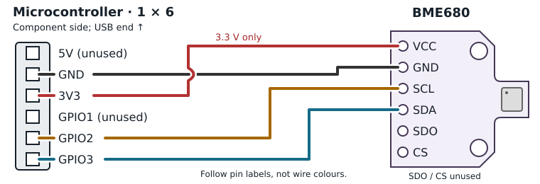

# Smart Home Sensor: Quick Reference

You build a small indoor air-quality and room-climate sensor: air quality, temperature, humidity and pressure on a little display. The sensor can also send its readings to an online dashboard or your own smart-home system (MQTT/Home Assistant compatible).

**Build instructions with pictures:** scan the QR code

## 1. Solder and wire the BME680

Thread the stripped ends through the pad holes **from the plain back**, bend them flat against the labelled front and solder there. Then wire the sensor to the board as shown.

> Swapped SDA/SCL and wrong board pins are the most common no-sensor causes.

## 2. Flash and test before assembly

**Web flasher:** `https://alexanderkutschera.com/smart_home_sensor`

1. Keep the sensor **outside the enclosure**; plug the board in.
2. Web flasher → select the **workshop image** → **Connect**.
3. Pick the port `USB JTAG/serial debug unit` → **Install**.
4. After the reboot, wait for green **OK** under **BME680 sensor** on the display.

## 3. Assemble the enclosure

- **Main housing** (bottom)
- **Board**: display to the open front
- **Lower inlay**: fixes board
- **Upper inlay**: BME680 in the recess, **component side up** towards the lid grille
- **Lid** (top)
- **Insulation** between board and sensor, e.g. the board's styrofoam

> **The lid goes on at an angle**, not straight down: slide its **long tab** into the rails, then lower the other edge until the **short tab** snaps in.

## 4. Set up on the device

1. First boot opens a Wi-Fi network named like **`SHS-Bouncy-Alpaca`** (no password) — use the exact name on the display.
2. Browse to **`192.168.4.1`** → **Configure WiFi** (2.4 GHz only).
3. **Setup:** give the device a name.
4. *Live readings & connection test* → **Send a test reading**. Green **✓ 201** or **200** means stored.
5. **Finish.**

> **Back into setup later: press RESET twice quickly.** The enclosure covers that button — slide the board out, or power up away from the saved Wi-Fi: with no known network it opens setup itself.

## 5. Your readings

The QR code on the display links straight to your readings. Missed it, or don't know your ID? Go to **diy-sensor.org/dashboard**, find the name you gave your device during setup and select it. New readings arrive every **5 minutes**; the display refreshes every few seconds.

## 6. Air quality

- **IAQ accuracy 0** stabilizing
- **1–2** calibrating (takes hours)
- **3** trusted — a drop back to 1 is normal, BSEC is rebuilding its baseline
- **IAQ 0–50** good · **51–100** moderate
- **101–150** light · **151–200** moderate
- **201–300** heavy · **300+** severe pollution

> **Temperature reads high** — the board warms the sensor. After 20–30 min, *add* the remaining error to the offset in the setup page: `new = current + (reported − real)`. It starts at 5 °C, not 0.

## 7. Troubleshooting

- **No port in the flasher?** Use a USB-C **data** cable. Still nothing: unplug, hold **BOOT**, plug in, release after ~2 s.
- **BME680 NOT FOUND:** power off and re-check the four wires — 3V3 (not 5V), GND, SDA → GPIO3, SCL → GPIO2 — and the solder joints.
- **No setup Wi-Fi:** look for the exact name on the display; 2.4 GHz only.
- **Test reading fails:** check the Wi-Fi password and internet access.
- **Nothing on the dashboard yet:** the first reading takes up to 5 min.
